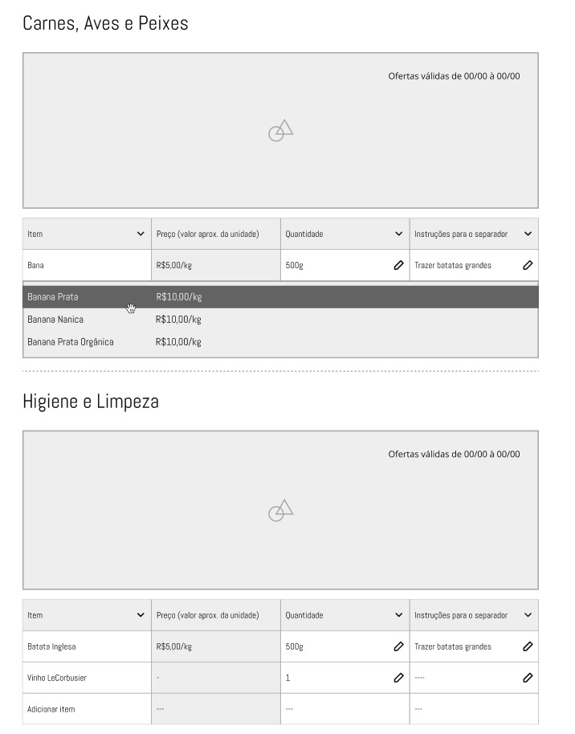

Protótipo funcional do WPP do HNT. Desenvolvido com ReactJS, Typescript, Axios, MirageJS, React Bootstrap e SCSS.
https://hortifruti-wpp.vercel.app/

## Mirage JS como "back-end"
MirageJS é uma biblioteca de simulação de API que permite construir, testar e compartilhar um aplicativo JavaScript funcional completo sem ter que depender de nenhum serviço de back-end.

```
###### Mirage: [200] GET https://hortifruti-wpp.vercel.app/api/products ######

const categorias = [
        {
          categoryName: "Frutas, legumes e verduras",
          items: [
            { id: 1, foodName: "Banana", foodPrice: 5 },
            { id: 2, foodName: "Banana Prata", foodPrice: 8 },
            { id: 3, foodName: "Banana d'água", foodPrice: 3 },
            { id: 4, foodName: "Banana selecionada", foodPrice: 10 },
            { id: 5, foodName: "Maça", foodPrice: 7 },
            { id: 6, foodName: "Uva", foodPrice: 6 },
          ],
        },
        {
          categoryName: "Padaria",
          items: [
            { id: 1, foodName: "Pão de Forma", foodPrice: 75 },
            { id: 2, foodName: "Pão Francês", foodPrice: 8 },
            { id: 3, foodName: "Pão Doce", foodPrice: 10 },
            { id: 4, foodName: "Coca Cola 2 Litros", foodPrice: 10 },
          ],
        },
      ];   
      
return categorias;
      
```



